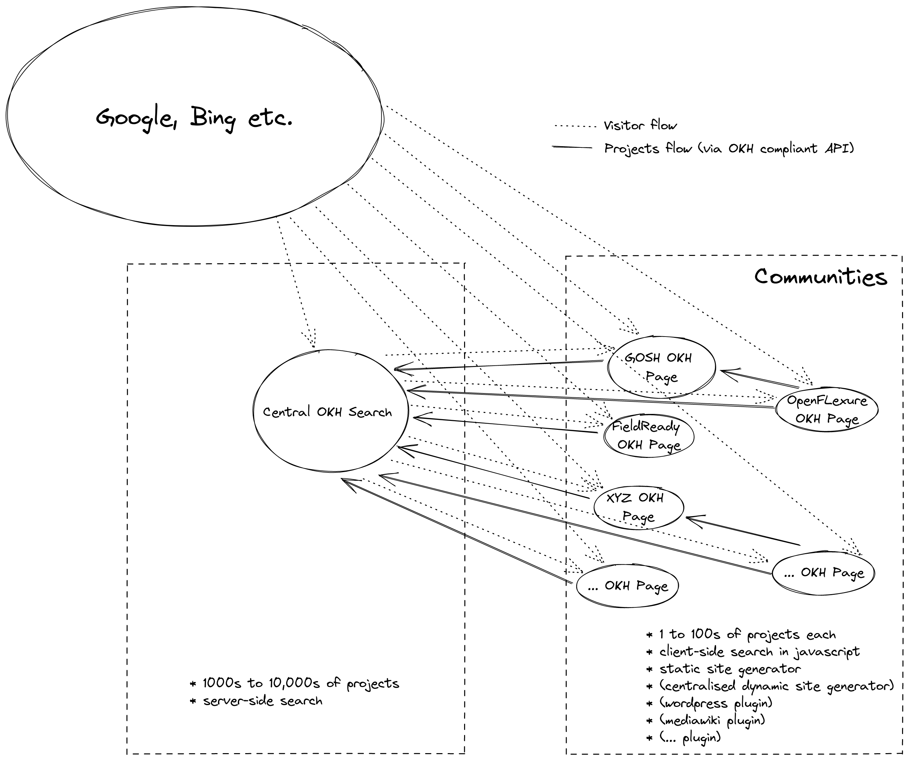
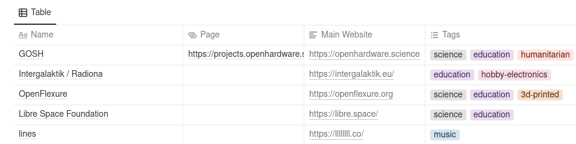
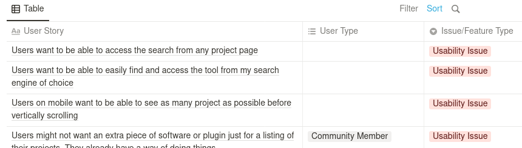
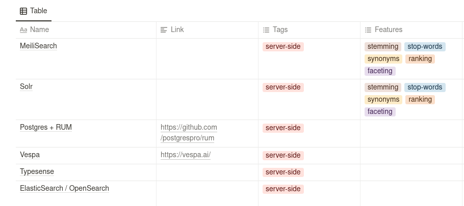

# Open Know-How Search Design Docs

A search engine for open source hardware that makes use of the [IOP-OKH][iop-okh] specification. A proof-of-concept v1 is available [here](https://github.com/iop-alliance/okh-search).

## Goals

- **We want to see high quality projects.** We want to surface projects that are in advanced stages of development and worth looking at and attempting to re-build. The front page and top results should be useful to someone looking for a project to work on.
- **We want to give visitors the information they need in a delightful way.** We want a modern, clean and accessible user interface. Something that is easy on the eyes, easy to use but also fast, responsive, powerful and, most importantly, contains the most relevant information to the visitor.
- **We want to let communities use our software for themselves.** We want light-weight instances of our search page to be able to be spun up by individuals and communities to present their projects, on their own cheap/free hosting. If given consent, these “light” instances will feed their data to a central instance that links back to them.
- **We want projects to be found.**  We are building a search engine but realistically people will use bigger search engines to find web pages served by our software. We need to optimize for this by following SEO best practices when generating pages.

## Architecture

([diagram source](https://excalidraw.com/#json=kXJcKO75tBfwyr-R47aPw,bYxgATlARFCm0NMwkunliw))

## Communities

We are already reaching out to communities and building prototypes of OKH pages for them.

- https://field-ready-projects.openknowhow.org
- https://projects.openhardware.science

[Example Communities Table](tables/example_communities.csv)

## Usability Issues/Features

[Usability Issues/Features table](tables/usability.csv)

## Search Library Comparison

[Search Libraries Table](tables/search_libraries.csv)

